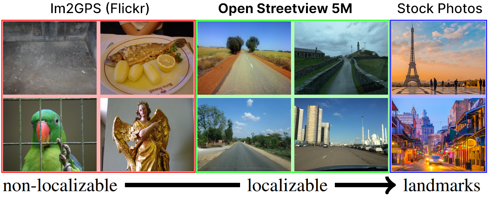
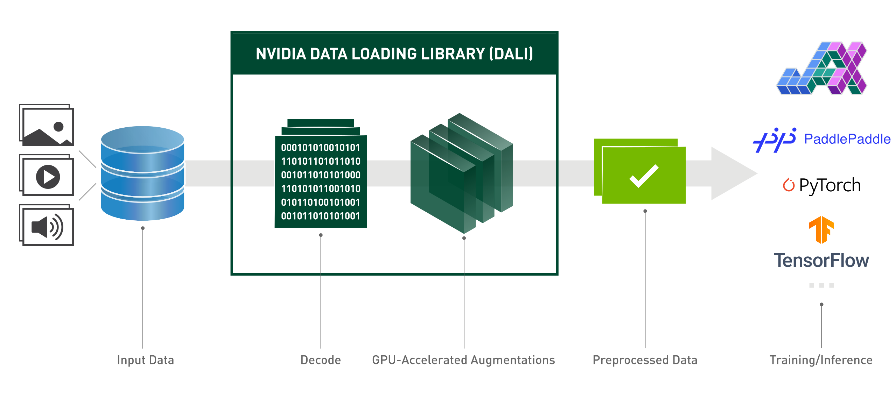
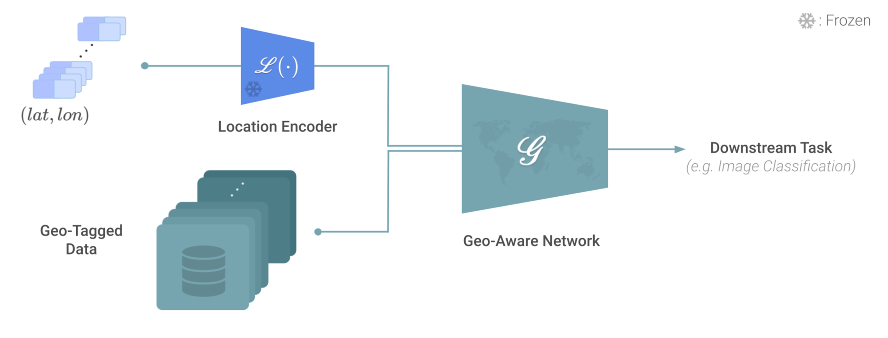
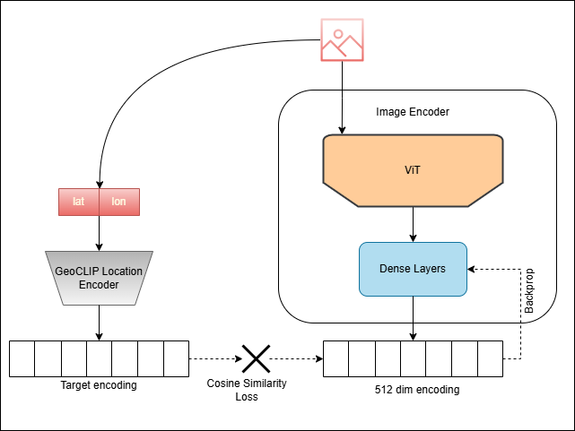
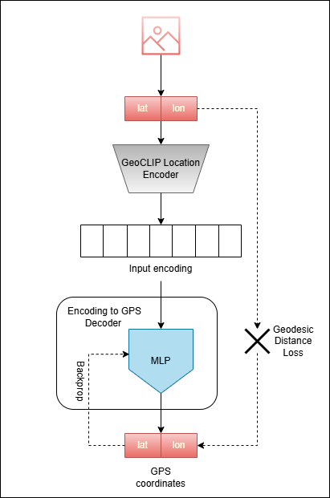
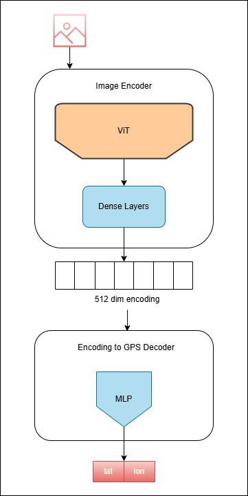
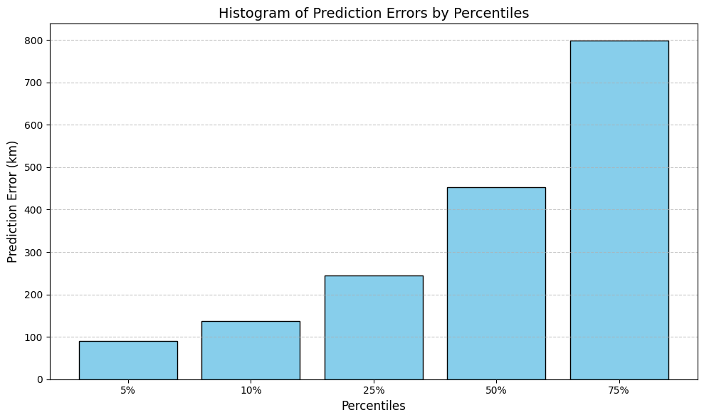
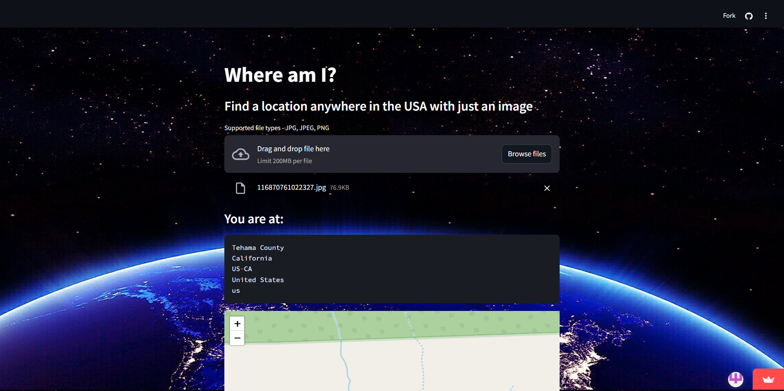

# Where Am I?


Transformer-backed geo-localizer to find a location in the USA based on street view image<br>

Check out the [Web App](https://where-am-i-hp.streamlit.app/)!

# Table of Contents
- [Where Am I?](#where-am-i)
- [Table of Contents](#table-of-contents)
- [Introduction](#introduction)
  - [Project Goal](#project-goal)
  - [Motivation](#motivation)
  - [Challenges](#challenges)
  - [Scope](#scope)
- [Project Structure](#project-structure)
- [Data](#data)
  - [Performance Challenges](#performance-challenges)
  - [NVIDIA DALI](#nvidia-dali)
- [Modeling](#modeling)
  - [GeoCLIP Location Encoder](#geoclip-location-encoder)
  - [Two-Phase Architecture](#two-phase-architecture)
    - [Training](#training)
    - [Benefits \& Drawbacks](#benefits--drawbacks)
- [Results](#results)
- [Future Scope](#future-scope)
- [Web App](#web-app)
- [Shoulders of Giants](#shoulders-of-giants)

# Introduction
## Project Goal
Create an Image-to-GPS system to accurately predict the location of an image
## Motivation
As a long-time GeoGuessr fan, the ability to pinpoint a location based on an image has intrigued me for a while. For those unaware, GeoGuessr is a geography game where you get an image and then based on that image, guess the location by placing a pin on the map. The closer your pin is to the actual location the more points you get. <br>
<strong>GeoGuessr UI</strong>


Now I am a very average player at GeoGuessr, but watching professionals like "Rainbolt" guess the location based on a pixelated photo of a blade of grass is a fascinating spectacle. I mean come on, guessing a country from an image in 0.1 seconds is truly superhuman stuff.
Check out this [Rainbolt's Video](https://www.youtube.com/embed/ff6E4mrUkBY?si=mXObQ8I8jk63LFzC)
, while I don't think I will be 'humanly' getting close to Rainbolt's speed and accuracy, maybe a machine can.

## Challenges
The world is a big place, duh. The way pros like Rainbolt perform so well in GeoGuessr is that they have memorized the minute details of the world by playing the game for a long time. Everything from the type of street light pole to the color of sand to the types of cars to the way languages look, these pros have it all stored in their mind. And there are a lot of these of course.<br>
1. <strong>Ambiguous Visual Features</strong><br>
     - Many locations look similar (e.g., forests, beaches, highways), making it hard to infer unique geolocation features from an image.<br>
     - Some images might lack identifiable landmarks or context altogether.
2. <strong>Scale Differences</strong><br>
     - The model must work across vastly different scales, from street-level views (e.g., urban photos) to regional or global landscapes (e.g., satellite images).
3. <strong>Lighting and Weather Conditions</strong><br>
     - Changes in lighting (e.g., day vs. night) and weather (e.g., rain, fog, snow) can obscure visual details.
4. <strong>Lighting and Weather Conditions</strong><br>
     - Changes in lighting (e.g., day vs. night) and weather (e.g., rain, fog, snow) can obscure visual details.
5. <strong>Dynamic Environments</strong><br>
      - Urban areas change over time due to construction, demolition, or vegetation growth, making older datasets less relevant.<br>
      - Moving elements (e.g., cars, people, animals) in the image can add noise to geolocation.

## Scope
As I started this project, I realized that global geo-localization is an active area of research with even the SOTA models achieving single-digit accuracy in city-level prediction. Moreover, the datasets for training such a model are hundreds of gigabytes in size, requiring powerful GPUs and taking a long time to train. Unfortunately my laptop RTX 3060 with its paltry 6GB of VRAM was not going to cut it, not for lack of my trying. This meant that I needed to use Google Colab's paid GPUs to train my models. Thus to keep the costs in check, this project's scope is limited to geo-localization of street view images for the USA only. However, the novel architecture that I used is well suited for scaling to global geo-localization. 

# Project Structure
This project follows the [CCDS Template](https://cookiecutter-data-science.drivendata.org/) with some modifications.

```
├── LICENSE            <- Open-source license if one is chosen
├── Makefile           <- Makefile with convenience commands like `make data` or `make train`
├── README.md          <- The top-level README for developers using this project.
├── data
│   ├── external       <- Data from third party sources.
│   ├── interim        <- Intermediate data that has been transformed.
│   ├── processed      <- The final, canonical data sets for modeling.
│   └── raw            <- The original, immutable data dump.
│
├── docs               <- A default mkdocs project; see www.mkdocs.org for details
│
├── models             <- Trained and serialized models, model predictions, or model summaries
│
├── notebooks          <- Jupyter notebooks. Naming convention is a number (for ordering),
│                         the creator's initials, and a short `-` delimited description, e.g.
│                         `1.0-jqp-initial-data-exploration`.
│
├── pyproject.toml     <- Project configuration file with package metadata for 
│                         src and configuration for tools like black
│
├── references         <- Data dictionaries, manuals, and all other explanatory materials.
│
├── reports            <- Generated analysis as HTML, PDF, LaTeX, etc.
│   └── figures        <- Generated graphics and figures to be used in reporting
│
├── requirements.txt   <- The requirements file for reproducing the analysis environment, e.g.
│                         generated with `pip freeze > requirements.txt`
│
├── setup.cfg          <- Configuration file for flake8
│
└── src   <- Source code for use in this project.
 │
 ├── __init__.py             <- Makes src a Python module
 │
 ├── config.py               <- Store useful variables and configuration
 │
 ├── dataset.py              <- Scripts to download or generate data
 │
 ├── features.py             <- Code to create features for modeling
 │
 ├── modeling                
 │   ├── __init__.py 
 │   ├── predict.py          <- Code to run model inference with trained models          
 │   └── train.py            <- Code to train models
 │
 └── plots.py                <- Code to create visualizations
```

--------

# Data
There are a couple of options for geo-localization datasets such as Im2GPS, Geo-Tagged NUS-WIDE, etc. The dataset that I chose is called [OpenStreetView-5M (OSV5M)](https://osv5m.github.io/). It is quite new, having been presented in CVPR 2024. The main benefit of OSV5M is well highlighted in their teaser picture.

Having a street-view only image dataset that can reliably be localized was highly beneficial and I am thankful to the team behind OSV5M for making this dataset publicly available. I extracted a subset of OSV5M which contains all the street-view images localized to the USA. This amounts to about 1.2 million images in the trainset. OSV5M also has a separate test set for validation purposes.

## Performance Challenges
As I mentioned earlier, training models on copious amounts of image data is a resource-intensive process. To get a baseline estimate of training time per epoch for the entire dataset, I measured performance on a subset of 32k images and extrapolated it to training on the whole dataset for 10 epochs.
| GPU | Time to Train (per epoch) |
| ------ | ------ |
|Colab A100|1.9 hrs|
|Colab T4|10 hrs|
|RTX 3060|21.6 hrs|

So for me to just train the model for a single epoch on my laptop, which would cost me nothing, would cost me about a day. Colab's T4 GPU reduces this time to about 10 hrs. T4 is available freely as well but the resources are not guaranteed and there is a limit of about 12 hrs per session. Colab's A100 which was the only realistic option to train is only available to paid users. Colab has a pay-as-you-go option where you buy a certain number of compute units and then the compute unit usage depends on the GPU used. So T4 costs about 1.44 compute units per hour while A100 costs about 8.47 compute units per hour. All this being said, 1.9 hrs per epoch was still painfully slow considering I was targeting about ~50 epochs worth of training and as a student, I was not about to spend hundreds of dollars for training.

## NVIDIA DALI
To understand the breakdown of time being taken for training, I ran a bunch of performance tests and found that about 80 - 90% of the time was spent in the image-to-tensor preprocessing. Decoding an image and converting it into a model-friendly tensor was the main bottleneck for optimizing training performance. I tried a couple of approaches - convert the images to [Safetensors](https://huggingface.co/docs/safetensors/en/index) locally and use these tensors for training directly on Colab, thus saving about 90% of training time of paid GPUs. The critical flaw here was that converting a JPG to a Tensor removes the compression, and the 1.2 million images which previously took about 56 GB of space, now took over 600 GB. Alternatively, I also tried [HDF5](https://docs.h5py.org/en/stable/), which adds some compression, but still amounts to about 300 GB of data. Since I was using Google Drive with about 100 GB of space, neither of these options was feasible.

Enter [NVIDIA DALI](https://github.com/NVIDIA/DALI)


The PyTorch Dataloader uses the CPU to load data and perform any transforms before passing the tensors, which can then be loaded to the GPU for training the model. DALI offloads data loading to the GPU providing speedup in cases where CPU is the bottleneck. And speedup it did.

| Colab A100 | PyTorch Dataloader | NVIDIA DALI |
| ------ | ------ | ----- |
|Time to Train (per epoch)|1.9 hrs| 16 mins |

Using NVIDIA DALI to load and transform images to tensors sped up the training by an incredible **10x**, thanks NVIDIA! All the transforms such as Horizontal and vertical flips, Random rotation, Color jitter (brightness adjustment), Gaussian blur as well as Normalization was also applied using the DALI pipeline. A major part of developing this project was spent on optimizing the training time, which included the data preprocessing as well as finding the right batch size for maximizing the GPU memory while balancing speed and stability.

# Modeling
Geo-localization using images has been traditionally a retrieval and/or classification problem, with each having its set of pros and cons:

| **Feature** | **Retrieval-Based** | **Classification-Based** |
|----------------------------------|------------------------------------------------------------|-------------------------------------------------------------|
| **Granularity** | Fine-grained: Can provide precise locations (e.g., a street or landmark). | Coarse-grained: Limited to the resolution of predefined classes (e.g., cities, countries). |
| **Scalability** | Requires large datasets and efficient indexing for scalability. | Scales with the number of classes but may struggle with high numbers. |
| **Labeling Requirement** | Needs geo-coordinates for all database images.             | Needs labeled images with predefined geographic regions.     |
| **Inference Time** | Slower, especially for large datasets without optimized retrieval systems. | Faster once trained, as it directly assigns a class.         |
| **Generalization** | Better at recognizing unseen locations similar to database entries. | Limited to the classes seen during training.                 |
| **Output** | A ranked list of similar images with locations.            | A single class label representing the region.                |
| **Challenges** | Requires efficient retrieval techniques and a comprehensive database. | Struggles with intra-class variability and inter-class similarity. |

For retrieval, maintaining a gigantic database of images is the primary issue. I intended to have this model deployed to a web app so the system needed to be lightweight. For classification, one is restricted to the number of classes being used for training. In my case, if I used even moderately fine-grained geo hashes as classes, the model would have to classify an image into one in a million classes!
## GeoCLIP Location Encoder
[GeoCLIP](https://paperswithcode.com/paper/geoclip-clip-inspired-alignment-between) is a current SOTA image geo-localization system. The system overcomes the limitations of the traditional retrieval-based approach by using GPS embeddings. Best explained by this excerpt from the paper's abstract
>"To overcome these limitations, we propose GeoCLIP, a novel CLIP-inspired Image-to-GPS retrieval approach that enforces alignment between the image and its corresponding GPS locations. GeoCLIP's location encoder models the Earth as a continuous function by employing positional encoding through random Fourier features and constructing a hierarchical representation that captures information at varying resolutions to yield a semantically rich high-dimensional feature suitable to use even beyond geo-localization. "

GeoCLIP provides the Location Encoder which outputs a 512-dim encoding based on a GPS coordinate (latitude, longitude). It can be understood that for a given pair of latitude and longitude, the Location Encoder outputs a unique vector in a 512-dimensional latent space. GPS coordinates that are closer to each other geodesically have encodings that are also closer(similar) to each other in the feature space, and vice versa is also true. Furthermore, these encodings are strictly generated from the given GPS coordinates. We use both these characteristics to our benefit.


## Two-Phase Architecture
To benefit from the fine-grained predictions of a retrieval-based system while mitigating some of its drawbacks, we will be using a two-phase architecture consisting of the following:
1. **Image Encoder:** The Image Encoder will be responsible for extracting image features and converting them into a 512-dimensional encoding. The Image Encoder has a frozen Vision Transformer (ViT) backbone and some trainable dense layers. For the ViT, I tested both Google Base ViT and Swin Large ViT. The Swin Large took a little more than double the time to train and after about 15 epochs wasn't performing better than Google Base. I chose to train the Google Base ViT for the rest of the training period as the tradeoff between training time and performance was not worth it for Swin. It is entirely possible that over the long run, Swin would've performed better, however, keeping training time in check was a priority here.
2. **Encoding to GPS Decoder:** This decoder will be responsible for converting the encodings into a latitude and longitude pair.

### Training
The two components are trained separately as follows:

**1. Image Encoder**<br>
   - An image is passed through the Image Encoder<br>
   - Corresponding pair of GPS coordinates (latitude and longitude) is fed into the GeoCLIP Location Encoder<br>
   - The Image Encoder outputs a 512-dimensional encoding for the image.<br>
   - The GeoCLIP Location Encoder generates a target encoding based on the input GPS coordinates.<br>
   - The Cosine Similarity Loss is computed between the image encoding and the target encoding. This measures how close the two encodings are in the latent space and is used for backpropagation.
  
The model learns to encode images into a 512-dimensional latent space, aligning it with a target encoding derived from GPS coordinates. The loss function ensures the two encodings (image and target) are as similar as possible.



**2. Encoding to GPS Decoder Training Loop**<br>
   - GPS coordinates are passed through the GeoCLIP Location Encoder, generating a 512-dimensional input encoding.<br>
   - The input encoding is fed into the Encoding to the GPS Decoder.<br>
   - The decoder outputs the predicted latitude and longitude.<br>
   - The Geodesic Distance Loss is computed between the predicted GPS coordinates and the ground truth. This loss reflects the great circle distance between two points on Earth, providing a geographically meaningful error metric, and is used for backpropagation.

The model learns to decode a latent space encoding back to its corresponding GPS coordinates. This enables geolocation prediction from encodings.



### Benefits & Drawbacks
Input images are fed to the Image Encoder, which outputs an encoding. This encoding is then provided as input to the Decoder, which outputs a GPS coordinate.



This novel two-phase architecture has several benefits over traditional retrieval based systems:
1. **No Database Needed:** Training the Decoder separately to recognize and translate the encoding into a GPS coordinate results in a pseudo-database-like system. We no longer need to maintain a database of images for retrieval.
2. **Restriction of search space:** The Decoder is trained to output latitude and longitude values specifically for the USA. This improves the accuracy of the system by restricting the search space.
3. **No predefined set of coordinates:** Since we output a range of GPS coordinates instead of relying on picking from a fixed set, we solve the issue of granularity that comes with predefined classes.
   
Classification-based systems output probabilities for the predefined classes, this often means that even if the most likely prediction is not correct, one of the top-k predictions will be. This is the main drawback of this system as we only have a single prediction.

# Results
The system performs fairly well on the test set. 

|**Mean Geodesic Distance Error** | **461.46 miles (742.65 km)**|
|---|---|
|Decoder Localization Error | 12.55 miles (20.2 km)|

It was observed that the predictions were usually within the same state or neighboring states. Some states like California had a much higher prediction accuracy, possibly due to its higher representation in the training set. 



While the mean error (742.65 km) is decent, the histogram shows that a significant proportion of predictions have errors under this value. However, a smaller subset of cases contributes to much larger errors. The larger errors in the upper percentiles suggest that the model struggles more with certain types of input images or GPS locations, potentially due to less representative data or regions that are harder to predict.

# Future Scope
1. **Multi-Modal System**: Having a text recognition system could improve the prediction accuracy by helping the system identify and associate certain road signs with certain locations
2. **Focus on Outliers**: Analyze cases in the upper percentiles to identify specific patterns (e.g., uncommon landscapes, low-quality images) causing high errors.
3. **Data Augmentation**: Introduce more diverse or representative training data for challenging regions.
4. **Fine-tuning**: Consider fine-tuning the model for specific regions where performance is suboptimal.

# Web App
The model is accessible with an interactive [web-app](https://where-am-i-hp.streamlit.app/). This allows users to upload or click a street view image and get back a predicted address for the said image. 



# Shoulders of Giants
[OpenStreetView-5M: The Many Roads to Global Visual Geolocation](https://osv5m.github.io/) <br>
[GeoCLIP](https://github.com/VicenteVivan/geo-clip)

<h2>Thank you for visiting!</h2>


